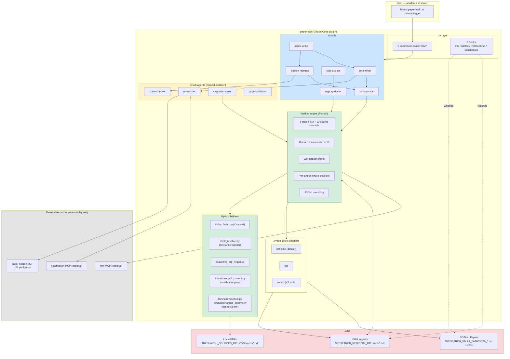
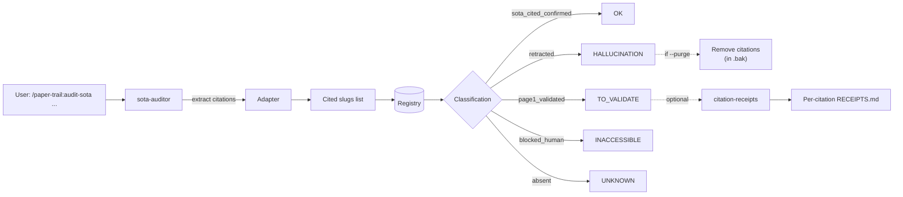
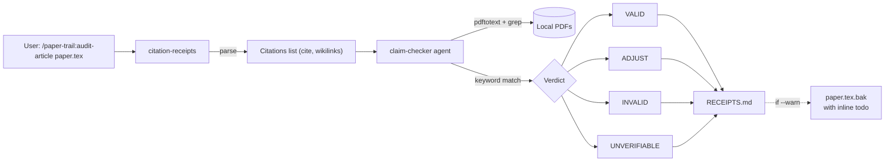

# Architecture

System overview of the `paper-trail` Claude Code plugin.

## 1. Global system



Color legend:
- **Green**: worker engine (Python, deterministic)
- **Blue**: Claude Code skills (orchestration)
- **Yellow**: sub-agents (context isolation for heavy work)
- **Gray**: external resources (user-configured MCPs)
- **Red**: persisted data (registry, PDFs, SOTAs)

## 2. Primary flows

### 2.1 Creating a SOTA without fabricated citations

```mermaid
flowchart LR
    U["User: /paper-trail:new-sota 'X'"] --> SW[sota-writer]
    SW -->|Phase A| RES[researcher]
    RES -->|paper-search MCP| LIST["Candidates list"]
    LIST -->|human selection| INGEST["Ingest as candidate refs"]
    INGEST -->|Phase B| PC[pdf-cascade]
    PC --> WB["Worker engine:<br/>cascade DL + page 1 validation"]
    WB --> P1[page1_validated refs]
    P1 -->|Phase C| READ["Notes in markdown body of each ref"]
    READ -->|Phase D| WRITE["SOTA draft<br/>(wikilinks to page1_validated)"]
    WRITE -->|PreToolUse hook| GATE{All validated?}
    GATE -->|yes| OUT["SOTA produced"]
    GATE -->|no| BLOCK["Write blocked,<br/>missing refs flagged"]
```



### 2.2 Auditing an existing SOTA



### 2.3 Auditing a paper (per-citation)



## 3. Worker engine FSM (8 states)

See `pipeline/ARCHITECTURE.md` for the detailed diagram. Summary:

```
candidate → uid_resolved → pdf_acquired → page1_validated → sota_cited_confirmed
                              ↓                                  ↑
                          awaiting_rtfm_ocr ──────────────────→
                              ↓
                          needs_reacquisition → uid_resolved (retry)

* → blocked_human:* (at any level, human decision required)
* → retracted (terminal, fabrication confirmed)
```

## 4. Acquisition cascade (10 sources)

```
1. Crossref OA       — DOI-based, OA metadata
2. arXiv             — preprints (CS/math/physics/etc.)
3. OpenAlex          — cross-domain aggregator
4. Unpaywall         — OA discovery
5. HAL               — Hyper Articles en Ligne (French academic)
6. CORE              — UK-based open repository aggregator
7. archive.org       — digitized books
(7.5 Sci-Hub_optin   — opt-in via RESEARCH_ENABLE_SHADOW_LIBS=1)
(7.6 AA_optin        — opt-in via RESEARCH_ENABLE_SHADOW_LIBS=1)
8. WebSearch queue   — manual fallback
```

Each source returns `success` / `page1_failed` / `failed` /
`no_source`. The cascade stops at the first `success` or the final
`failed` (all sources exhausted).

Mandatory page 1 anti-homonymy validation before `success`:
- Expected author present
- Title similarity ≥ 0.3 (distinctive keywords)
- Zero off-domain keywords

## 5. Doctor — 19 invariants

| Category | Invariants |
|---|---|
| Frontmatter validity | I1 (state valid), I2 (slug unique), I3 (uid prefix) |
| PDF consistency | I4 (pdf_path normalized), I5 (PDF exists), I6 (sha256 valid), I18 (sha drift) |
| FSM consistency | I7 (page1 log), I8 (state_history monotonic), I14 (no exit from terminal) |
| Audit | I9 (attempts numbered), I10 (blocked reason), I15 (OCR overdue) |
| SOTA reciprocity | I11 (cited_in exists), I12 (reciprocity) |
| Duplicates | I13 (sha256 unique) |
| RTFM correlation | I16 (RTFM failure mirror), I17 (PDF format invalid), I19 (PDF image-only) |

Auto-fix available: I4, I6, I9 (cosmetic) + I5, I7 semi (transition
to `needs_reacquisition`).

## 6. Adapter pattern

The adapter resolves vault-specific conventions without hardcoding
Obsidian in the code.

```python
class Adapter(ABC):
    def index_md_files(self) -> set[str]: ...      # for I11
    def find_sotas(self) -> list[Path]: ...        # for I12
    def parse_citations(self, sota_path) -> list[str]: ...
    def sota_output_path(self, topic_slug) -> Path: ...
    def format_citation(self, slug) -> str: ...
```

Three implementations:

- **Obsidian** (default): wikilinks `[[slug]]`, SOTAs as `SOTA_*.md`
- **Flat**: Markdown links `[text](refs/slug.md)`, SOTAs under
  `sotas/`
- **Zotero**: V2 stub

Switch via `RESEARCH_VAULT_LAYOUT=obsidian|flat|zotero`.

## 7. Integrity hooks

| Hook | Matcher | Action |
|---|---|---|
| `PreToolUse` Write\|Edit | SOTA files | Refuses write if citations are not validated |
| `PostToolUse` Write\|Edit | `**/refs/*.md` | Mini-doctor on edited reference (warn-level) |
| `SessionEnd` | (all) | `pipeline doctor --severity error` |

All non-blocking except `PreToolUse` SOTA (anti-hallucination
philosophy of the plugin).

## 8. Configuration

Environment variables (precedence: see `pipeline/config.py`):

| Var | Default | Purpose |
|---|---|---|
| `RESEARCH_VAULT_PATH` | `~/research_vault` | Vault root |
| `RESEARCH_SOURCES_PATH` | `$VAULT/sources` | PDF directory |
| `RESEARCH_REGISTRY_PATH` | `$SOURCES/_registry` | YAML registry |
| `RESEARCH_VAULT_LAYOUT` | `obsidian` | Adapter |
| `RESEARCH_ENABLE_SHADOW_LIBS` | unset | AA + Sci-Hub |
| `RESEARCH_ENABLE_NOTEBOOKLM` | unset | NotebookLM in sota-writer phase A |
| `RESEARCH_SKIP_END_DOCTOR` | unset | Skip SessionEnd hook |

## 9. Cross-references

- `pipeline/ARCHITECTURE.md` — worker engine detail (FSM, cascade,
  doctor)
- `NOTICE.md` — attributions
- `DISCLAIMER.md` — shadow libraries
