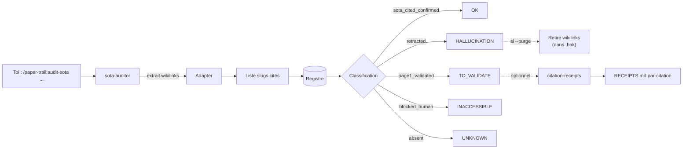
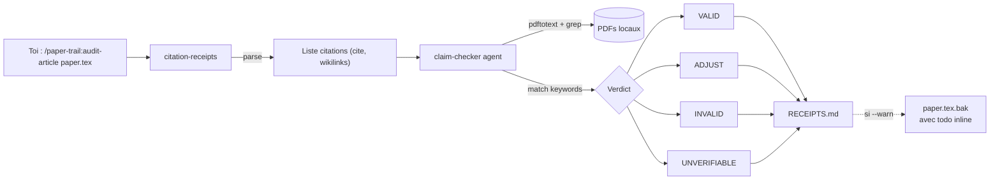

# ARCHITECTURE — paper-trail

Vue d'ensemble de l'architecture du plugin Claude Code paper-trail.

## 1. Système global


Couleurs :
- **Vert** : moteur worker B (Python, déterministe)
- **Bleu** : skills Claude Code (orchestration)
- **Jaune** : sub-agents (isolation contexte pour tâches lourdes)
- **Gris** : ressources externes (MCPs configurés par l'utilisateur)
- **Rouge** : données persistées (registre, PDFs, SOTAs)

## 2. Flux principaux

### 2.1 Cas A — Créer un SOTA non halluciné

```mermaid
flowchart LR
    U["Toi : /paper-trail:new-sota 'X'"] --> SW[sota-writer]
    SW -->|Phase A| RES[researcher]
    RES -->|paper-search MCP| LIST["Liste candidates"]
    LIST -->|Choix humain| INGEST["Ingest as candidate refs"]
    INGEST -->|Phase B| PC[pdf-cascade]
    PC --> WB["Worker B :<br/>cascade DL + page 1 validation"]
    WB --> P1[page1_validated refs]
    P1 -->|Phase C| READ["Notes en markdown body de chaque ref"]
    READ -->|Phase D| WRITE["Rédaction SOTA<br/>(wikilinks vers page1_validated)"]
    WRITE -->|Hook PreToolUse| GATE{Tous validés ?}
    GATE -->|oui| OUT["SOTA produit"]
    GATE -->|non| BLOCK["Write bloqué,<br/>refs manquantes signalées"]
```



### 2.2 Cas B — Auditer un SOTA existant



### 2.3 Cas B — Auditer un article (per-citation)



## 3. FSM worker B (8 états)

Voir `pipeline/ARCHITECTURE.md` pour le diagramme détaillé. Résumé :

```
candidate → uid_resolved → pdf_acquired → page1_validated → sota_cited_confirmed
                              ↓                                  ↑
                          awaiting_rtfm_ocr ──────────────────→
                              ↓
                          needs_reacquisition → uid_resolved (retry)

* → blocked_human:* (à n'importe quel niveau, décision humaine requise)
* → retracted (terminal, hallucination confirmée)
```

## 4. Cascade d'acquisition (10 sources)

```
1. Crossref OA       — DOI-based, métadonnées OA
2. arXiv             — preprints CS/math/physics/etc.
3. OpenAlex          — agrégateur cross-domaine
4. Unpaywall         — OA discovery
5. HAL               — Hyper Articles en Ligne (French academic)
6. CORE              — UK-based open repository aggregator
7. archive.org       — digitized books
(7.5 Sci-Hub_optin   — opt-in via RESEARCH_ENABLE_SHADOW_LIBS=1)
(7.6 AA_optin        — opt-in via RESEARCH_ENABLE_SHADOW_LIBS=1)
8. WebSearch queue   — fallback manuel
```

Chaque source retourne `success` / `page1_failed` / `failed` /
`no_source`. La cascade s'arrête au premier `success` ou au `failed`
final (toutes sources épuisées).

Page 1 validation anti-homonymie obligatoire avant `success` :
- Auteur attendu présent
- Similarité titre ≥ 0.3 (keywords distinctifs)
- Zéro keywords off-domain

## 5. Doctor — 19 invariants

| Catégorie | Invariants |
|---|---|
| Frontmatter formel | I1 (state valid), I2 (slug unique), I3 (uid prefix) |
| Cohérence PDF | I4 (pdf_path normalisé), I5 (PDF existe), I6 (sha256 valide), I18 (sha drift, Couche 5) |
| Cohérence FSM | I7 (page1 log), I8 (state_history monotonique), I14 (no exit terminal) |
| Audit | I9 (attempts num), I10 (blocked reason), I15 (OCR overdue) |
| Cohérence SOTAs | I11 (cited_in existe), I12 (réciprocité) |
| Doublons | I13 (sha256 unique) |
| RTFM (Couche 5) | I16 (RTFM failure miroir), I17 (PDF format défectueux), I19 (PDF image-only) |

Auto-fix : I4, I6, I9 (cosmétique) + I5, I7 semi (transition vers
`needs_reacquisition`).

## 6. Adapter pattern

L'adapter résout les conventions vault-spécifiques sans hardcoder
Obsidian dans le code.

```python
class Adapter(ABC):
    def index_md_files(self) -> set[str]: ...    # pour I11
    def find_sotas(self) -> list[Path]: ...      # pour I12
    def parse_citations(self, sota_path) -> list[str]: ...
    def sota_output_path(self, topic_slug) -> Path: ...
    def format_citation(self, slug) -> str: ...
```

3 implémentations :
- **Obsidian** (default) : wikilinks `[[slug]]`, SOTAs en `SOTA_*.md`
- **Flat** : Markdown links `[text](refs/slug.md)`, SOTAs sous `sotas/`
- **Zotero** : stub V2

Switch via `RESEARCH_VAULT_LAYOUT=obsidian|flat|zotero`.

## 7. Hooks d'intégrité

| Hook | Matcher | Action |
|---|---|---|
| `PreToolUse` Write\|Edit | SOTA files | Refuse l'écriture si refs cités non validés |
| `PostToolUse` Write\|Edit | `**/refs/*.md` | Mini-doctor sur ref éditée (warn-level) |
| `SessionEnd` | (toutes) | `pipeline doctor --severity error` |

Tous non-bloquants sauf le `PreToolUse` SOTA (philosophie
anti-hallucination du plugin).

## 8. Configuration

Variables d'environnement (par-priorité, voir `pipeline/config.py`) :

| Var | Défaut | Usage |
|---|---|---|
| `RESEARCH_VAULT_PATH` | `~/research_vault` | Racine vault |
| `RESEARCH_SOURCES_PATH` | `$VAULT/sources` | Dossier PDFs |
| `RESEARCH_REGISTRY_PATH` | `$SOURCES/_registry` | Registre YAML |
| `RESEARCH_VAULT_LAYOUT` | `obsidian` | Adapter |
| `RESEARCH_ENABLE_SHADOW_LIBS` | (non) | AA + Sci-Hub |
| `RESEARCH_ENABLE_NOTEBOOKLM` | (non) | NotebookLM dans sota-writer phase A |
| `RESEARCH_SKIP_END_DOCTOR` | (non) | Skip SessionEnd hook |

## 9. Cross-references

- `pipeline/ARCHITECTURE.md` — détail worker B (FSM, cascade, doctor)
- `plans/PLUGIN_EXECUTION_PLAN.md` — plan de construction
- `plans/SYSTEM_ARCHITECTURE.md` — vision système doctorale
- `NOTICE.md` — attributions
- `DISCLAIMER.md` — shadow libraries
