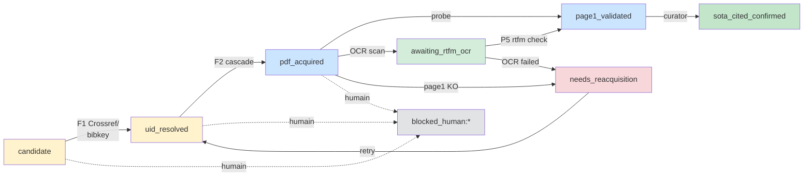
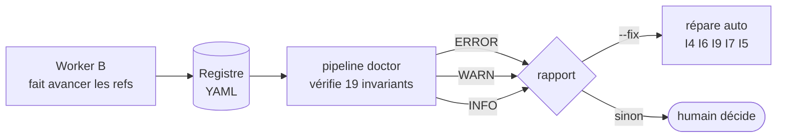

# Worker B — Architecture en images

Doc visuelle pour comprendre vite. Pour le détail, voir
`plans/B_worker_FSM_pipeline.md` et `plans/plan-design.md`.

---

## 1. À quoi sert le worker

Tu as un registre de 909 références bibliographiques (sous
`_registry/refs/*.md`). Chaque ref est un fichier YAML avec un `state` qui
dit où la ref en est dans le processus :

- est-ce qu'on connaît son identifiant unique (DOI, arXiv, ISBN…) ?
- est-ce qu'on a téléchargé son PDF ?
- est-ce que la page 1 du PDF correspond bien (anti-homonymie) ?
- est-ce qu'elle a été confirmée comme citation valide dans un SOTA ?

Le worker B prend toutes les refs en attente et les fait avancer
mécaniquement, dans un ordre strict. Aucune citation ne peut être validée
sans avoir traversé toutes les étapes.

---

## 2. La machine d'état (FSM) — vue d'oiseau



Légende couleurs :

- **jaune** : la ref n'a pas encore son PDF
- **bleu** : PDF acquis, en cours de validation
- **vert clair** : en attente OCR
- **vert** : terminé (citation validée)
- **rouge** : à re-télécharger
- **gris** : décision humaine requise

---

## 3. La cascade — comment on trouve un PDF

Quand une ref est en `uid_resolved`, le worker essaie 10 sources dans
l'ordre. Le **premier succès gagne**. Si une source échoue, on passe à la
suivante. Si toutes échouent → `cascade_exhausted` → blocked_human.

```mermaid
flowchart TD
    Start([ref en uid_resolved]) --> S1{1. Crossref OA<br/>via DOI}
    S1 -->|succès| Done([page1_validated])
    S1 -->|fail| S2{2. arXiv}
    S2 -->|fail| S3{3. OpenAlex}
    S3 -->|fail| S4{4. Unpaywall}
    S4 -->|fail| S5{5. HAL}
    S5 -->|fail| S6{6. CORE}
    S6 -->|fail| S7{7. archive.org<br/>(F3)}
    S7 -->|fail| S8{8. Sci-Hub}
    S8 -->|fail| S9{9. Anna's Archive<br/>(scidb+libgen)}
    S9 -->|fail| S10{10. WebSearch<br/>queue}
    S10 -->|fail| Block([blocked_human:<br/>cascade_exhausted])
    S2 -->|succès| Done
    S3 -->|succès| Done
    S4 -->|succès| Done
    S5 -->|succès| Done
    S6 -->|succès| Done
    S7 -->|succès| Done
    S8 -->|succès| Done
    S9 -->|succès| Done
    S10 -->|succès| Done
```

À chaque tentative, le worker logge dans `acquisition_attempts[]` du YAML :

```yaml
acquisition_attempts:
  - n: 1
    source: crossref_oa
    verdict: no_source           # pas de DOI
  - n: 2
    source: arxiv
    verdict: no_match            # pas trouvé
  - n: 3
    source: archive_org
    verdict: success
    pdf_path: 11_Biblio_MIR/Sources/Arnold_1982.pdf
    pdf_sha256: 8a3b…
```

**Important** : si une source a déjà été tentée (présente dans
`acquisition_attempts`), elle est skippée au run suivant
(`skipped_already_tried`). C'est pour ça que vider `acquisition_attempts`
permet de retenter une ref depuis zéro.

---

## 4. Anti-fabrication — pourquoi tout ce contrôle

Avant le worker, les citations étaient écrites « de mémoire ». Résultat
sur P9α v1 (2026-02) : 12 erreurs biblio dont un *quote* fabriqué → paper
retiré.

Garde-fous mécaniques actuels :

1. **F1 Crossref strict** : `title_similarity ≥ 0.7` + `year_diff ≤ 1`,
   sinon rejet. Anti-homonymie sur titre.
2. **Page 1 validation** : ouvre la page 1 du PDF téléchargé, extrait
   auteur + titre, compare aux attendus. Si mismatch → `quarantine` +
   `needs_reacquisition`.
3. **`pdf_sha256`** : hash du fichier stocké dans le YAML. Si le PDF est
   remplacé en silence, l'invariant I18 le détecte.
4. **Lock fichier** (Couche 2) : un seul `pipeline run` à la fois,
   impossible de corrompre le registre par concurrence.

---

## 5. Les invariants — sur-couche de vérification

Le worker fait avancer les refs. Le **doctor** vérifie que le registre
reste cohérent : 19 invariants I1-I19 (4 couches).



Catégories d'invariants :

- **Couche 1 (I1-I15)** — cohérence interne du registre :
  - I1 état valide, I2 slug unique, I3 uid valide
  - I4 chemin PDF normalisé, I5 PDF présent sur disque, I6 sha256 valide
  - I7 page1 log cohérent, I8 historique trié
  - I9 numérotation des tentatives, I10 raison de blocage présente
  - I11/I12 cohérence avec les SOTAs qui citent la ref
  - I13 doublons PDF, I14 pas de sortie depuis état terminal
  - I15 OCR en retard depuis > 30 jours

- **Couche 5 (I16-I19)** — corrélation avec RTFM :
  - I16 RTFM signale un échec d'indexation pour ce PDF
  - I17 format PDF défectueux
  - I18 drift sha256 (fichier différent de ce qui est dans le YAML)
  - I19 PDF scan-only sans source texte testée

---

## 6. Ce qui s'est passé dans la session courante

```mermaid
flowchart TB
    A[État initial 2026-05-24<br/>909 refs<br/>209 blocked_human sans :<br/>798 ERROR / 1989 WARN doctor] --> B[Fix bug I11/I12<br/>recherche récursive SOTAs]
    B --> C[Doctor : 1989 → 312 WARN<br/>1801 → 153 WARN sur I11]
    C --> D[Réinjection 209 legacy<br/>state → candidate<br/>attempts → []<br/>blocked_reason → supprimé]
    D --> E[État actuel<br/>240 candidates<br/>0 blocked_human<br/>I1 : 209 → 0]
    E --> F{prochain run<br/>pipeline run<br/>--state candidate}
    F --> G[Worker reprend les 240<br/>cascade essaie F1...F10<br/>certaines progressent<br/>d'autres re-bloquent<br/>avec catégorie propre]
```

---

## 7. Décisions encore ouvertes (à toi)

| Quoi | Options | Notes |
|---|---|---|
| Les 240 candidates | Lancer `pipeline run --state candidate` | ~16-48 min (5-15 refs/min). Faisable maintenant. |
| Drift résiduel (504 I8 + 153 I11 + 139 auto-fix) | Audit ultérieur, par invariant | Pas bloquant. Le registre tourne. |
| `--fix` du drift cosmétique | Plus tard si besoin | I9/I4/I6 changent rien à la sémantique, juste nettoyage YAML. |

---

## 8. Vocabulaire minimal

- **ref** : une entrée de bibliographie (1 fichier `.md` dans `_registry/refs/`)
- **frontmatter** : le bloc YAML en tête du fichier
- **slug** : identifiant unique de la ref (= nom du fichier sans `.md`)
- **state** : où la ref en est dans la FSM (cf. §2)
- **cascade** : la séquence de 10 sources de téléchargement (cf. §3)
- **SOTA** : revue de littérature qui cite des refs (fichier `SOTA_*.md`
  ailleurs dans le vault)
- **doctor** : `pipeline doctor`, vérifie les invariants (cf. §5)
- **drift** : écart entre l'état attendu et l'état réel du registre,
  accumulé au fil du temps
