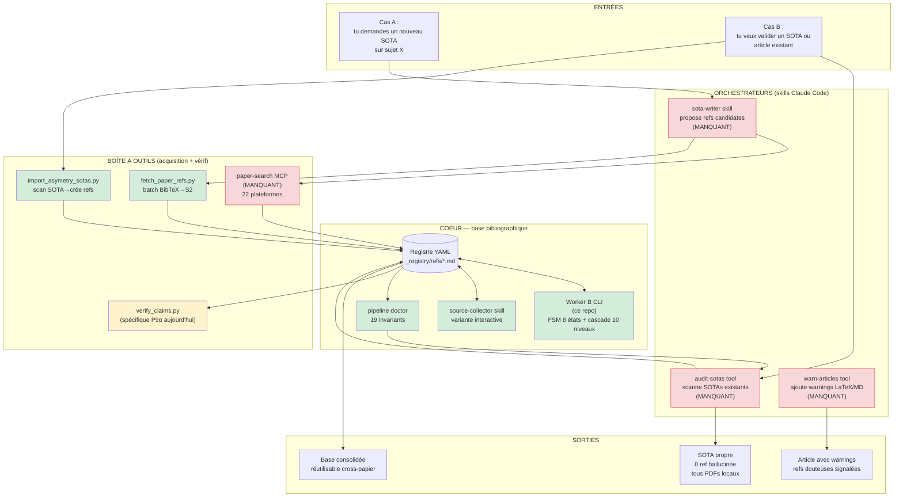
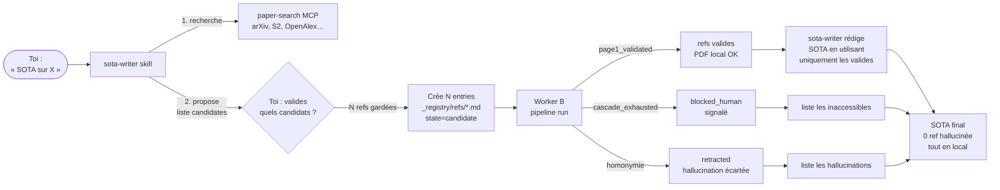
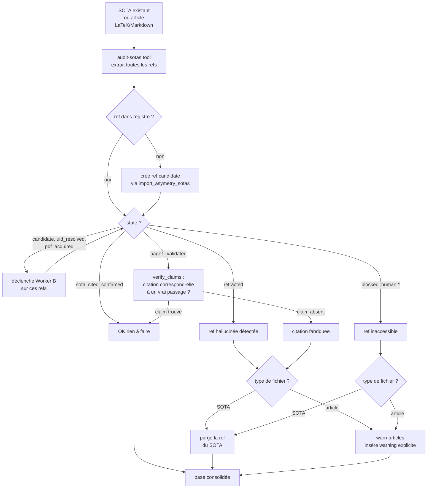

# Architecture système — pipeline anti-hallucination doctoral

> Doc d'archi globale. Le worker B (ce repo) n'est qu'un maillon. Ici on
> regarde tout le système : création de SOTAs, validation d'articles
> existants, consolidation de la base. Et on identifie ce qui manque.

---

## 0. But

Garantir, mécaniquement, que **toute citation dans un SOTA ou un article
de thèse correspond à une vraie référence, identifiée correctement, dont
le PDF est sur disque**. Bloquer les hallucinations à la source, signaler
celles déjà introduites, consolider une base de connaissances propre.

Origine : P9α v1 (2026-02) retiré pour 12 erreurs biblio dont un quote
fabriqué. Cause racine : citations écrites « de mémoire ».

---

## 1. Vue d'ensemble du système cible

Légende : **vert** = existe et fonctionne, **jaune** = existe partiellement,
**rouge** = manque ou désactivé.

---

## 2. Inventaire des composants

| Composant | Statut | Rôle | Localisation |
|---|---|---|---|
| Registre YAML | ✅ | 909 refs en `_registry/refs/*.md` | `/mnt/d/.../10_SOURCES/_registry/` |
| Worker B CLI | ✅ | FSM + cascade, batch automatisé | ce repo |
| pipeline doctor | ✅ | 19 invariants, vérif cohérence | ce repo |
| `source-collector` skill | ✅ | Variante interactive worker B | `~/.claude/plugins/source-collector/` |
| `fetch_paper_refs.py` | ✅ | Batch BibTeX→Semantic Scholar→PDFs | `musicology-phd/scripts/` |
| `import_asymetry_sotas.py` | ✅ | Scan SOTA→extrait `[[slug]]`→crée refs | `_registry/tools/` |
| `verify_claims.py` | ⚠️ | Vérif claim↔PDF, **hardcodé pour P9α** | `musicology-phd/scripts/` |
| `paper-search` MCP | ❌ | Recherche unifiée 22 plateformes | référencé dans `source-collector/SKILL.md` mais absent de `mcp.json` |
| `sota-writer` skill | ❌ | Orchestre création complète d'un SOTA | **À CRÉER** |
| `sota-curator` skill | ❌ | Confirme citations, drive `sota_cited_confirmed` | **À CRÉER** |
| `audit-sotas` tool | ❌ | Audite tous SOTAs existants, purge refs hallucinées | **À CRÉER** |
| `warn-articles` tool | ❌ | Insère warnings dans LaTeX/MD pour refs douteuses | **À CRÉER** |

---

## 3. Cas A — Créer un nouveau SOTA "non halluciné"

### Ce que tu veux

> « Je demande au skill de me créer un SOTA sur un sujet ; il faut qu'il
> ait tous les outils sous la main pour me garantir qu'à la fin j'ai un
> SOTA avec 0 ref hallucinées et toutes bien identifiées et téléchargées
> en local. »

### Flux cible

### Gaps actuels

1. **`paper-search` MCP** : référencé dans `source-collector/SKILL.md`
   (`mcp__paper-search__search_openalex`, etc.) mais pas dans
   `mcp.json`. Sans lui, `sota-writer` ne peut pas faire la recherche
   multi-plateforme unifiée. **À réactiver / réinstaller.**
2. **`sota-writer` skill** : n'existe pas. C'est l'orchestrateur qui
   doit : (a) lancer la recherche, (b) proposer les candidates,
   (c) déclencher le worker, (d) rédiger le SOTA en respectant le résultat.
   **À créer.**
3. Boucle de proposition humain-in-the-loop : où l'humain accepte/refuse
   chaque candidate avant qu'elle entre dans le pipeline. **À designer.**

### Composants réutilisables

- Worker B : prêt à recevoir des refs en `candidate`
- `fetch_paper_refs.py` : déjà fonctionnel pour batch — peut servir de
  base au sota-writer si l'orchestration reste simple
- `source-collector` skill : déjà capable de driver la FSM en mode
  interactif (donc utilisable comme sous-couche de `sota-writer`)

---

## 4. Cas B — Valider un SOTA / article existant

### Ce que tu veux

> « Pour tous les SOTAs existants, articles en cours de rédaction ou déjà
> rédigés, il faut que toutes les refs soient vérifiées comme non
> hallucinées et citations confirmées sinon, on doit remonter des alertes :
> les SOTAs doivent être purgés des refs hallucinées, pour les articles,
> des warnings explicites doivent être ajoutés. Idem pour référence réelle
> mais non téléchargeable. Dans tous les cas on doit consolider la base. »

### Flux cible

### Gaps actuels

1. **`audit-sotas` tool** : n'existe pas. Doit scanner *tous* les SOTAs
   du vault et croiser avec le registre. `import_asymetry_sotas.py`
   couvre une partie (extraction des wikilinks) mais ne fait pas
   l'audit complet ni la purge.
2. **`verify_claims.py` généralisé** : aujourd'hui hardcodé pour
   `Paper9alpha_v1.tex`. Doit devenir générique (paramétrable par
   chemin LaTeX/MD, par projet).
3. **`warn-articles` tool** : n'existe pas. Doit savoir ouvrir un
   LaTeX ou Markdown, repérer la position d'une citation, insérer un
   warning visible (commentaire LaTeX, callout Obsidian, etc.).
4. **Définition de "ref hallucinée" automatique** : aujourd'hui c'est
   `state == "retracted"`. Mais une ref `blocked_human:title_mismatch`
   après cascade exhaustive est-elle « hallucinée » ou « inaccessible » ?
   Règle à formaliser.

---

## 5. Le worker B en détail

Voir `pipeline/ARCHITECTURE.md` (FSM 8 états, cascade 10 sources,
19 invariants). C'est l'organe qui fait avancer une ref de `candidate`
à `sota_cited_confirmed`. Il est **complet et opérationnel**.

---

## 6. Roadmap pour combler les gaps

### Priorité 1 — Bouclage de l'existant

| # | Action | Effort | Impact |
|---|---|---|---|
| 1 | Vérifier où est passé `paper-search` MCP, le réinstaller ou installer un équivalent | 30 min | débloque Cas A |
| 2 | Lancer `pipeline run --state candidate` sur les 240 candidates actuelles | 16-48 min | nettoie l'existant |
| 3 | Auditer les 504 I8 (`state_history` non monotone) — bug ou migration ? | 1-2h | clarifie le drift résiduel |

### Priorité 2 — Construire `sota-writer` (Cas A)

| # | Action | Effort | Impact |
|---|---|---|---|
| 4 | Spécifier le skill `sota-writer` : entrée=sujet, sortie=SOTA + refs en `sota_cited_confirmed` | 1 session design | base contract |
| 5 | Implémenter MVP : utilise `paper-search` MCP + worker B + humain-in-the-loop pour valider candidates | 2-3 sessions | débloque le Cas A complet |

### Priorité 3 — Construire l'audit (Cas B)

| # | Action | Effort | Impact |
|---|---|---|---|
| 6 | Généraliser `verify_claims.py` (paramétrable par fichier source) | 1 session | base de Cas B |
| 7 | Créer `audit-sotas` tool : scanne tous SOTAs, classe les refs (OK / hallucinée / inaccessible / non vérifiée) | 1-2 sessions | rapport global |
| 8 | Créer `warn-articles` tool : insère warnings dans LaTeX/Markdown | 1 session | finalise Cas B |

### Priorité 4 — Sota-curator (boucle SOTA↔refs)

Cf. `plans/plan-design.md` §4. Le worker B expose déjà
`pipeline events` (Couche 3) qui liste les refs récemment validées et
leur SOTA destinataire. Reste à brancher un skill curator qui
consomme cette liste et déclenche la confirmation sémantique.

---

## 7. Décisions à prendre (humain)

1. **`paper-search` MCP** : on le réinstalle, ou on en choisit un autre
   (ex. MCPs `paper-search-mcp`, `scholar-mcp`, ou implementation maison
   via `requests` sur OpenAlex+S2+arXiv) ?
2. **Granularité Cas A** : skill `sota-writer` autonome (qui écrit le
   markdown lui-même) ou semi-auto (te propose juste les refs, tu écris
   le SOTA) ?
3. **Warnings article** : format exact attendu — commentaire LaTeX
   `\todo{}`, callout Obsidian `> [!warning]`, fichier `.warnings.md`
   séparé ?

Une fois ces 3 décisions prises, les priorités 2-3 deviennent
implémentables sans ambiguïté.
